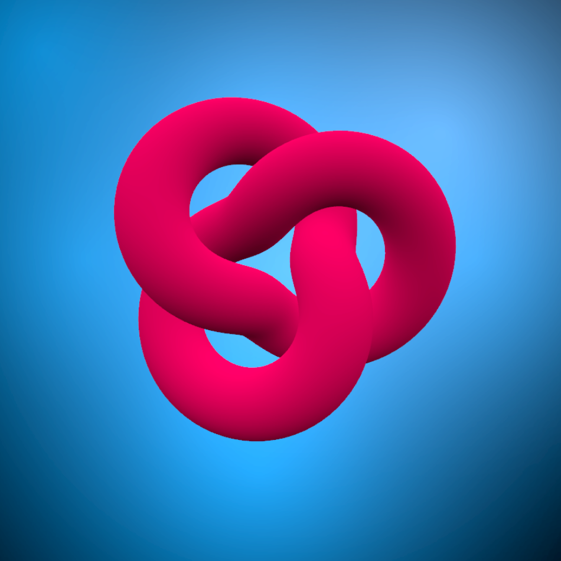

# Three.js WebGPU Template

A simple JavaScript project using Three.js with WebGPU. Includes a torus knot with orbit controls and a background sprite layer.



## Features
- **Three.js**: Uses the WebGPU renderer for better performance.
- **Orbit Controls**: Allows user interaction via mouse movement.
- **Hemisphere Lighting**: Adds a basic lighting setup.
- **Background Sprites**: Uses `getLayer.js` to add background sprite effects.

## Installation
Ensure you have a local development server (such as `live-server` or `http-server`) to serve your files.

```sh
# Clone the repository
git clone https://github.com/bobbyroe/threejs-webgpu-template.git
cd threejs-webgpu-template
```

## Usage
Run a local server to serve the project:

```sh
npx http-server
```
or fire up Live Server

Then open `http://localhost:8080` (or the appropriate URL) in your browser.

## File Structure
```
/
├── index.html          # Main HTML file
├── main.js             # Main JavaScript file (Three.js setup)
├── libs/
│   ├── getLayer.js     # Helper function for background sprites
```

## Dependencies
- [Three.js](https://threejs.org/) (WebGPU Renderer, Orbit Controls)
- Node.js (optional, for serving files locally)

## Development
Modify `main.js` to experiment with different Three.js objects, materials, or effects.

## License
This project is licensed under the MIT License. Feel free to modify and distribute.

